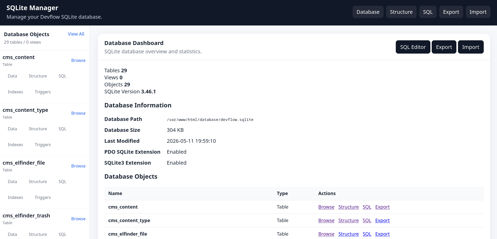

## Description

SQLite admin gives you an interface to interact with your SQLite database if you've chosen SQLite as the database 
repository for your Devflow CMF install.

> __Requires__ Devflow Version: 2.x

> __Tested Up To:__ 2.0.0

> __Requires PHP:__ 8.4+

> __Stable Tag:__ 1.0.1

> __License:__ GPLv2-only

## Screenshot


## Database-level features

* Display database file information
* Display SQLite version and PDO SQLite availability
* Show database file size
* Show last modified timestamp
* Download database backup
* Export database as SQL
* Export database as CSV
* Import SQL file
* Import CSV file
* VACUUM database
* PRAGMA integrity_check
* Optional PRAGMA optimize

## Table Features

* List tables and views
* Browse rows
* Paginate rows
* Sort rows
* Search/filter rows
* View table structure
* View CREATE TABLE
* Create table
* Rename table
* Empty table
* Drop table
* Insert row
* Edit row
* Delete row
* Add column
* Rename column
* Drop column when supported
* Manage indexes
* Manage triggers

## SQL Editor Features

* Free-form SQL editor
* Multiple statement execution
* Result table rendering
* Query timing
* Affected row count

## Localization
Portuguese, Chines (Simplified), German, English, Spanish, French, Italian Japanese, and Russian

## Composer Installation
1. Start a new shell session.
2. In the root of your install, run the following command ```composer require getdevflow/sqlite-admin```.

## Changelog

### 1.0.1
- Fixed route loading issue.

### 1.0.0
- Initial release.

